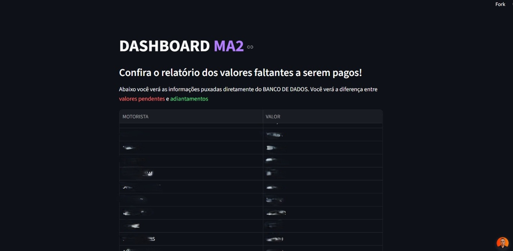

# 🚚 Dashboard de Controle de Fretes e Pagamentos

Uma aplicação web full-stack desenvolvida para automatizar a leitura, o cálculo e a persistência de dados de fretes logísticos. O sistema extrai pendências financeiras em tempo real de uma planilha, processa as regras de adiantamento e exibe um painel de controle interativo com mapa de calor.

## 🚀 Funcionalidades
* **Integração com API Externa:** Leitura autônoma de dados via Google Sheets API utilizando Conta de Serviço (GCP).
* **Tratamento de Dados:** Consolidação de valores, conversão de tipagem e cálculo de valores líquidos.
* **Persistência de Dados (Back-end):** Gravação diária do histórico de pendências em banco de dados relacional (SQLite).
* **Interface Dinâmica (Front-end):** Dashboard web interativo construído em Streamlit.

## 🛠️ Tecnologias Utilizadas
* **Python** (Lógica de Negócio)
* **Streamlit** (Front-end web e visualização)
* **SQLite** (Banco de dados relacional / Histórico)
* **Gspread / Google Cloud Console** (Comunicação com a API do Sheets)

## Exemplo do funcionamento
